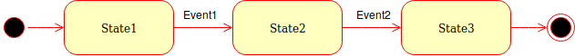
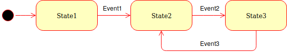
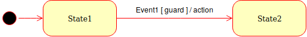

# sml-rs: State Machine Language DSL in Rust

[](https://travis-ci.org/korken89/sml-rs)

A state machine language DSL based on the syntax of [Boost-SML](https://boost-experimental.github.io/sml/).

## Aim

The aim of this DSL is to facilitate the use of state machines, as they quite fast can become overly complicated to write and get an overview of.

## Transition DSL

The DSL is defined as follows (from Boost-SML):

```rust
Transition DSL:
statemachine!{
    SrcState + Event [ guard ] / action = DstState,
    *SrcState + Event [ guard ] / action = DstState, // * denotes starting state
    // ...
}
```

Where `guard` and `action` are optional and can be left out. A `guard` is a function which returns `true` if the state transition should happen, and `false`  if the transition should not happen, while `action` are functions that are run during the transition which are guaranteed to finish before entering the new state.

This implies that any state machine must be written as a list of transitions.

## TODOs

Features missing:

* Add so `Events` can have data associated to them which is passed to the `guard` and `action`
* Have the transition DSL automatically generate a DOT graph for easier debug
* Give the state machine a settable type
* Look into adding a context structure into the state machine to handle user added data

## Examples

Here are some examples of state machines converted from UML to the State Machine Language DSL.

### Linear state machine



DSL implementation:

```rust
statemachine!{
    *State1 + Event1 = State2,
    State2 + Event2 = State3,
}
```

### Looping state machine



DSL implementation:

```rust
statemachine!{
    *State1 + Event1 = State2,
    State2 + Event2 = State3,
    State3 + Event3 = State2,
}
```

### Using guards and actions



DSL implementation:

```rust
statemachine!{
    *State1 + Event1 [guard] / action = State2,
}
```

## Contributors

List of contributors in alphabetical order:

* Emil Fresk ([@korken89](https://github.com/korken89))

---

## License

Licensed under either of

- Apache License, Version 2.0 ([LICENSE-APACHE](LICENSE-APACHE) or
  http://www.apache.org/licenses/LICENSE-2.0)

- MIT license ([LICENSE-MIT](LICENSE-MIT) or http://opensource.org/licenses/MIT)

at your option.

